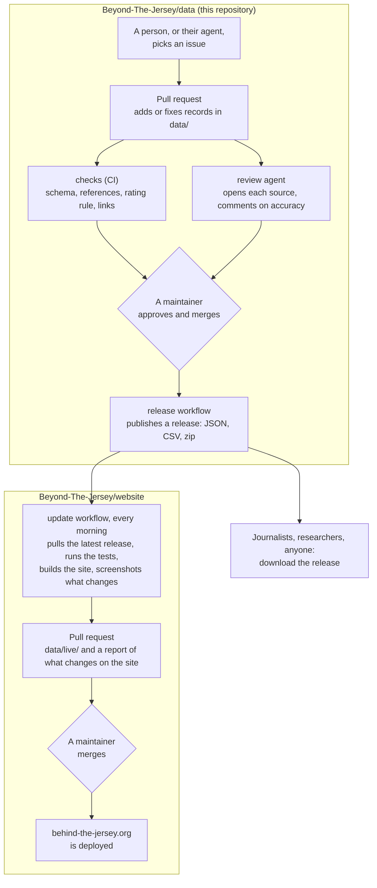

# Behind the Jersey: open data

Who really pays for the sponsors on sports shirts, and how much human-rights abuse sits behind the money. This is the data behind [behind-the-jersey.org](https://behind-the-jersey.org). It's open for anyone to use and anyone to improve.

Every fact has a source. Ratings follow a written method ([METHOD.md](METHOD.md)), and a person reviews every change before it's published.

## How it works

Data goes through two reviews before it's on the website: one here for each change, and one on the website for each update of the site.



**Why the website gets its own pull request.** The two reviews answer different questions:

| | Pull request here | Update pull request on the website |
|---|---|---|
| **Asks** | Is this record right, and does its source say so? | Do we want the site to say all of this now? |
| **Covers** | One issue: a club, a sponsor, a fix | Everything merged since the last update, together |
| **Shows** | The records that change | What changes on the site: club levels, sponsor ratings, clubs and sponsors added or removed, screenshots of the pages |
| **Checked by** | CI, the review agent, a maintainer | The site's tests and build, then a maintainer |

- **Changes add up on the site.** Each merge here is right record by record, but the effect only shows when they come together. One sponsor's new tier can move twenty clubs to Stained or Soaked at once. That's a public statement about those clubs, and the ratings are still illustrative, so a person looks at the result before it goes out.
- **Valid data can still break a page.** The website's tests and build run on the new data before anything is public.
- **The site shows one known version of the data**, committed in the website's `data/live/`. A deploy of a code fix never pulls in data nobody has looked at, and going back is reverting one pull request.
- **It can be loosened later.** If the updates prove routine, the workflow could merge its pull request by itself when no club's level changes. That would be a small change to the workflow.

Without the second step, a merge here would change the live site the next time it's built, with nobody having seen the combined result.

## Use the data

Download the [latest release](https://github.com/Beyond-The-Jersey/data/releases/latest). Each release has:

| File | What's in it |
|---|---|
| `behind-the-jersey-data.zip` | Everything below in one download |
| `clubs.csv`, `sponsors.csv`, `claims.csv`, `kit_sponsors.csv`, `deals.csv` | Spreadsheet-friendly tables, with each club's current rating and each sponsor's owner chain |
| `clubs.json`, `sponsors.json`, `owners.json`, `claims.json`, `kits.json`, `deals.json`, … | The full dataset, one JSON array per type: what the website reads |
| `meta.json` | When the data was last updated and which commit it was built from |

A direct link to any file always gets the newest version, e.g. `https://github.com/Beyond-The-Jersey/data/releases/latest/download/sponsors.csv`.

**How the data fits together**

- A **club** wears a **kit** each season. The kit lists its **sponsors** and where each one sits (front, back, sleeve…).
- A **sponsor** is owned by an **owner**. Owners chain up to a parent, e.g. Riyadh Air → Public Investment Fund → Government of Saudi Arabia.
- **Claims** are sourced statements about an owner, such as its human-rights record. A sponsor's **tier** (severe, serious, concern, nothing found) rests on them.
- A club's **blood level** (Clean, Spotted, Stained, Soaked) comes from its current kit's sponsor tiers and where they sit, by the rule in [METHOD.md](METHOD.md). It's in `clubs.csv`.
- **Deals** hold reported values and dates. **Changes** and **dropped** record what moved.
- **Contacts** hold sourced ways to reach a club.

The field-by-field definitions are the JSON Schemas in [`schema/`](schema).

**Licence:** the data is [CC BY 4.0](LICENSE-DATA.md). Credit "Behind the Jersey (github.com/Beyond-The-Jersey/data)". The code is [MIT](LICENSE). Images aren't part of this dataset: [`assets/`](assets) lists candidate sources and their licences.

**Please keep in mind:**
- Ratings are illustrative until the method is final.
- Deal values are reported estimates, not club accounts.
- Where a source link is missing, the record says so.

## Improve the data

Anyone can help, by hand or with an AI agent: pick an [issue](https://github.com/Beyond-The-Jersey/data/issues), add or fix records, and open a pull request. [CONTRIBUTING.md](CONTRIBUTING.md) explains how. If you bring an agent, point it at [`agents/research.md`](agents/research.md).

Every pull request:
- is checked automatically: schema, references, the rating rule, and whether the links resolve;
- is read by a review agent that compares each claim with its source;
- is merged only after a person approves it.

After a merge, a new release is published, and the website picks it up through its own pull request ([How it works](#how-it-works)).

## What's in this repository

```
data/                   the records: one JSON file per record, named by its id
  clubs/arsenal.json      sponsors/emirates.json      claims/uae-mass-trial-2024.json
  kits/  owners/  deals/  leagues/  sports/  changes/  dropped/  contacts/
  levels.json  tiers.json  order.json   (the rating scale, and the order sports and leagues appear in)
schema/                 JSON Schemas, one per record type: the contract with the website and other users
scripts/                validate.py, check_links.py, build.py (standard Python; validate needs jsonschema)
agents/                 briefs for research agents and the review agent
assets/                 candidate image sources with licences (images themselves live with the website)
docs/                   coverage/ (research leads per target) and the record of past migrations
```

Run the checks locally:

```bash
pip install jsonschema
python3 scripts/validate.py
python3 scripts/check_links.py --base origin/main
python3 scripts/build.py        # writes dist/, the release
```
